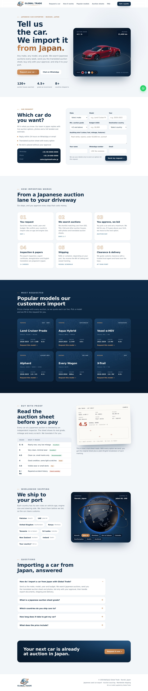

# Global Trade — Japanese Car Import Website

A five-page, SEO-ready website for **株式会社 Global Trade**, a Japanese used-car exporter. Customers tell the company which car they want; the team sources it from Japanese auctions, shares the translated auction sheet, buys with the customer's approval and ships it worldwide.

## Pages
- **Home** — 3D car showroom (drag to rotate, change paint), car request form, import steps, popular models, auction sheet, 3D shipping globe, FAQ
- **Import from Japan** — full service page: what's included, process, price breakdown (FOB/CIF), country guide, how to read an auction sheet, FAQ
- **Gallery** — 3D showroom and studio renders with filter and lightbox
- **About Us**
- **Contact** — contact cards and car request form that opens WhatsApp with a ready message

## Built with
HTML, CSS, vanilla JavaScript, three.js (WebGL) for the 3D showroom and globe, JSON-LD schema for SEO (AutoDealer, Service, FAQPage, BreadcrumbList).

Designed and developed by **Jassra Naeem**.
